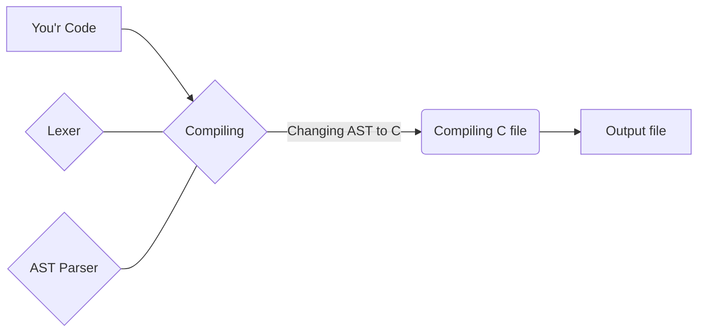

# BinJS

## About

**BinJS** is a compiler of JavaScript to Binary

## How BinJS is working?

```mermaid
    flowchart LR;
      A[You'r Code]-->B{Compiling};
      B--Changing AST to C-->C(Compiling C file)
      C-->D[Output file]
      E{Lexer} & F{AST Parser}---B;
```
